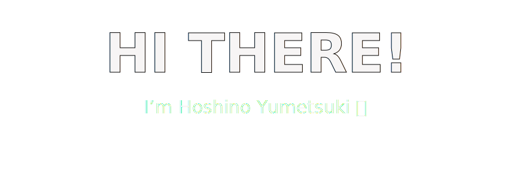

  

<i align="right" style="float: right;width: 250px;margin: 0 0 20px 20px;border: 1px solid #d9d9d9;border-radius: 4px;"><small>Copyright © 2025 Q78KG. All rights reserved.</small></i>

You can also call me 星野梦月 or Q78KG. Welcome to my profile!

---

### 🌸 Visitor Count

You are my

visitor!

---

### 📊 GitHub Stats

---

### 🏆 GitRoll Badge

